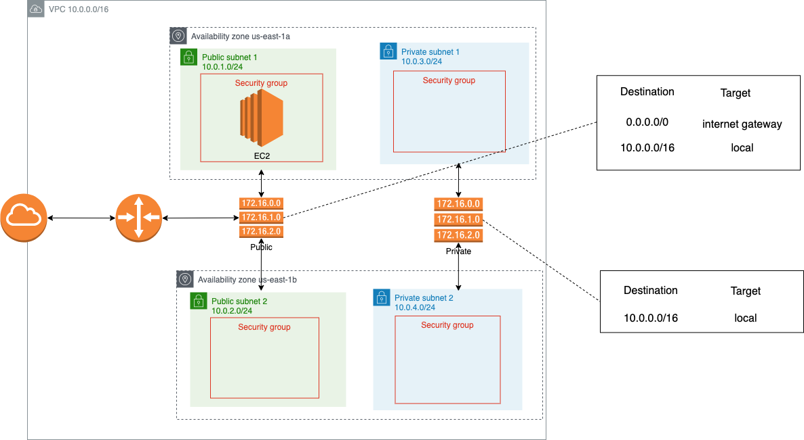

# Introduction
This project creates a VPC in us-east-1, 4 subnets(2 public, 2 private), spanning 2 Availability Zones(AZs), along with the relevant route table, network ACL, security group.

An EC2 instance is created and placed in the first public subnet.

# Reference
https://learn.hashicorp.com/collections/terraform/aws-get-started

# Architecture
